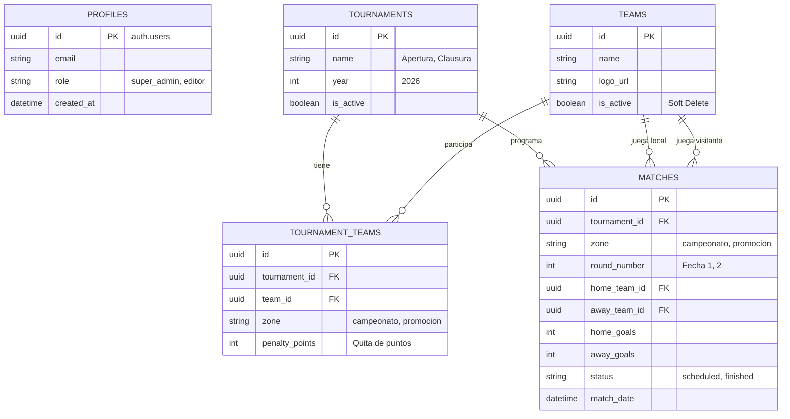

# Resultados Liga Marplatense de Fútbol (LMF)

Plataforma moderna, rápida y escalable para visualizar en tiempo real las tablas de posiciones, fixtures y resultados de la Liga Marplatense de Fútbol, diseñada con un look & feel "Premium" y soporte responsivo para dispositivos móviles.


## 🚀 Características Principales

- **Diseño Premium UI/UX:** Interfaz moderna con Glassmorphism (cristal esmerilado), gradientes oscuros, animaciones con Framer Motion y total adaptabilidad responsiva.
- **Fixture y Posiciones Históricas:** Permite filtrar las tablas por Año (ej. 2025, 2026) y Torneo (ej. Apertura, Clausura, Oficial).
- **Escudos Reales:** Integración automatizada para utilizar escudos en alta calidad y generación automática de SVG vectoriales con los colores de los clubes locales si no se encuentran.
- **Panel de Administración Completo:** Dashboard protegido por autenticación para la gestión rápida de:
  - ABM de Equipos (Borrado lógico para no perder historial y subida de Logos).
  - Configuración de Torneos y Años.
  - Generación de Fixtures y carga rápida de goles/resultados.
  - Tribunal de Disciplina (quita de puntos).

## 🛠 Stack Tecnológico

El proyecto está diseñado para ser de código abierto, gratuito, rápido y altamente escalable:

- **Frontend:** [React 18](https://reactjs.org/) + [Vite](https://vitejs.dev/) + [TypeScript](https://www.typescriptlang.org/)
- **Estilos:** [Tailwind CSS v3](https://tailwindcss.com/)
- **Animaciones:** [Framer Motion](https://www.framer.com/motion/)
- **Iconos:** [Lucide React](https://lucide.dev/)
- **Backend & Base de Datos:** [Supabase](https://supabase.com/) (PostgreSQL open-source)
- **Hosting:** [Vercel](https://vercel.com/)

---

## 🗄 Arquitectura de Base de Datos (Supabase)

El sistema utiliza PostgreSQL gestionado por Supabase para ser escalable, rápido y permitir actualizaciones en tiempo real (Realtime). A continuación se muestra la estructura de tablas y sus relaciones:



---

## 💻 Desarrollo Local

### 1. Requisitos Previos
- Node.js (v18 o superior)
- npm o yarn

### 2. Instalación

1. Clona el repositorio:
```bash
git clone https://github.com/gorellano/resultados-liga-mdp-futbol.git
cd resultados-liga-mdp-futbol
```

2. Instala las dependencias:
```bash
npm install
```

3. Crea un archivo `.env` en la raíz del proyecto basándote en el ejemplo:
```bash
cp .env.example .env
```

4. Inicia el servidor de desarrollo:
```bash
npm run dev
```

El proyecto estará corriendo en `http://localhost:5173`.

---

## 🐘 Guía de Configuración Supabase

Supabase nos brinda Base de Datos Postgres, Autenticación y Storage de forma gratuita en su plan "Hobby" (suficiente para la Liga Marplatense).

1. Ingresa a [Supabase.com](https://supabase.com) y crea un nuevo proyecto (Organization: elige una gratuita, Name: `Resultados LMF`, Region: `South America - São Paulo` para menor latencia).
2. Espera unos minutos a que se aprovisione la base de datos.
3. Ve a **Project Settings -> API** y copia la `Project URL` y la `anon public key`. Pégalas en tu archivo `.env` local:
   ```env
   VITE_SUPABASE_URL="https://tu-proyecto.supabase.co"
   VITE_SUPABASE_ANON_KEY="tu-anon-key-larga"
   ```
4. Ve a **SQL Editor** en el panel izquierdo de Supabase, crea un nuevo query y **pega todo el contenido del archivo `supabase/schema.sql`** que se encuentra en este repositorio. Haz clic en "Run". Esto creará todas las tablas y políticas de seguridad (RLS).
5. Ve a **Storage** y crea un nuevo bucket llamado `logos`. Asegúrate de marcar la opción "Public" para que las imágenes puedan verse en la web.
6. Ve a **Authentication -> Users** y dale a "Add User" -> "Create new user".
   - Crea un usuario con email (ej. `admin@ligamdp.com`) y una contraseña segura.
   - Gracias al Trigger SQL de `schema.sql`, ese primer usuario se creará automáticamente como `super_admin` en la tabla `profiles`.

---

## 🚀 Guía de Despliegue en Vercel

Vercel es la mejor plataforma para hostear aplicaciones Vite/React.

1. Sube tu código a GitHub (si aún no lo has hecho).
2. Crea una cuenta gratuita en [Vercel.com](https://vercel.com/).
3. Haz clic en **"Add New..."** -> **"Project"**.
4. Importa el repositorio de GitHub `resultados-liga-mdp-futbol`.
5. En la sección de configuración de despliegue, despliega la pestaña **"Environment Variables"**.
6. Agrega las dos variables de Supabase:
   - Name: `VITE_SUPABASE_URL` | Value: `[Tu URL de Supabase]`
   - Name: `VITE_SUPABASE_ANON_KEY` | Value: `[Tu llave anónima]`
7. Haz clic en **"Deploy"**.

¡En 1 minuto tendrás tu aplicación corriendo con un dominio HTTPS seguro! Vercel actualizará tu sitio automáticamente cada vez que hagas un `git push` a la rama principal (main).
